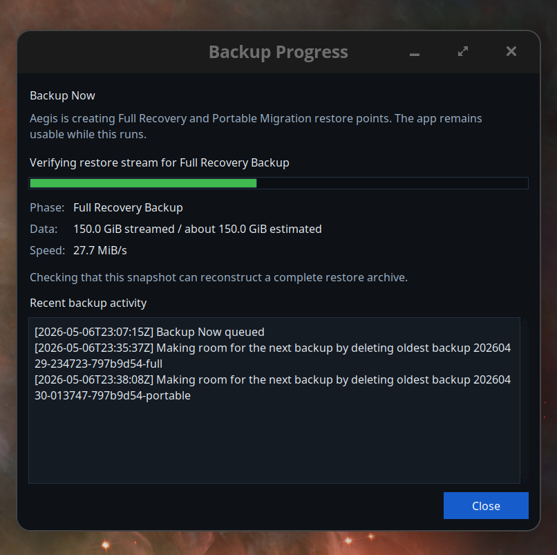
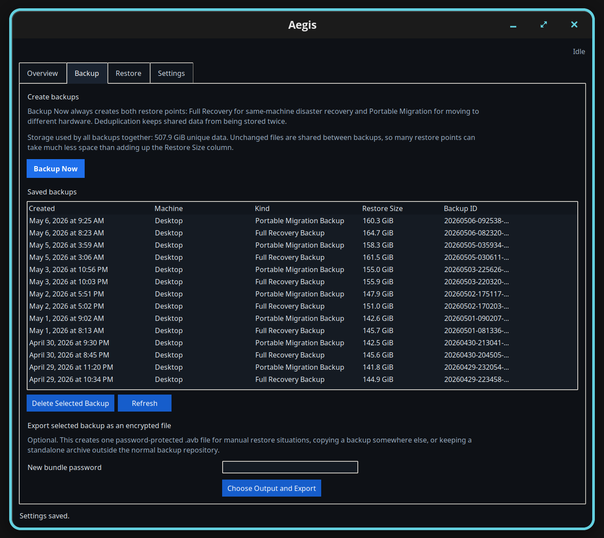

# Aegis

The core backup, restore, and recovery USB features have been tested on Debian based systems (like Ubuntu and Pop!_OS) on my gaming PC, my 2011 Macbook Air, and my 2019 Macbook Pro with the T2 chip. I built Aegis to protect my own Linux systems. However, because system configurations vary wildly, this software is provided "as is" without absolute guarantees. Please be smart with your critical data and always maintain multiple backups across multiple physical devices. We are not liable for any data loss.



## Install

Install with 1 command:

```bash
curl -fsSL https://raw.githubusercontent.com/MagnetosphereLabs/Aegis/main/install.sh | sudo bash -s -- install
```

Update with 1 command:

```bash
curl -fsSL https://raw.githubusercontent.com/MagnetosphereLabs/Aegis/main/install.sh | sudo bash -s -- update
```

Uninstall with 1 command:

```bash
curl -fsSL https://raw.githubusercontent.com/MagnetosphereLabs/Aegis/main/install.sh | sudo bash -s -- uninstall
```

## The Design Philosophy

Aegis is a single file application containing a graphical interface, terminal interface, background daemon, and backup engine. It operates natively on Debian based systems like Pop!_OS and Ubuntu. 

Most open source backup utilities treat data preservation as the primary goal while treating system restoration as an afterthought that you need to do manually and painstakingly. Aegis treats seamless bare metal restoration as the primary fundamental goal.

## The Leap in Linux Recovery

Consider what happens during an unrecoverable physical hardware failure, such as severe NAND degradation or a corrupted NVMe controller causing catastrophic partition loss. Your operating system is gone. 

Tools like Timeshift are brilliant for reverting a broken package update using local snapshots, but they cannot restore a system to a completely blank replacement drive. 

Tools like Borg or Restic provide incredible cryptographic deduplication. However, recovering a destroyed machine with them requires you to manually provision a live OS, manually recreate your GUID partition tables, mount filesystems, extract the data, enter a rescue environment, and manually repair your bootloader. 

Aegis automates this entire pipeline for unparalleled convenience. 

* **Automatic Recovery Media:** Aegis provisions a bootable Debian recovery USB directly from the application interface. It even supports devices with the Apple T2 chip.
* **Guided Full Restore:** Boot from the USB, point it at your backup drive, and Aegis will automatically execute disk partitioning, format the EFI and root filesystems, extract the archive stream, and inject the proper bootloader configurations for your specific hardware.

## Technical Architecture

The application runs a persistent background process bound to a Unix socket. 

### Smart Boundary Deduplication

Aegis uses standard archive tools to read your filesystem, ensuring POSIX permissions and extended attributes are preserved. However, saving massive single archives wastes storage. Standard block deduplication often fails on archive streams due to data shifting. If one file changes, every byte after it shifts, ruining subsequent block hashes.

Aegis solves this by inspecting the byte stream in real time. It actively scans for standard archive header byte signatures. When the buffer reaches an optimal threshold, it cuts the chunk precisely at a file boundary. This guarantees that untouched files align perfectly and hash identically during future backups, saving immense disk space without requiring complex rolling hashes.



### Cryptography

Chunks are encrypted locally before they ever touch your storage drive. Aegis implements AES GCM cryptography using keys derived via Scrypt. Local unlock credentials integrate directly into the system credential store, allowing unattended scheduled backups while keeping your exported repository secure.

## Hardware Portability

Copying an existing Linux installation from a gaming PC with NVIDIA graphics to your laptop with AMD graphics usually results in immediate kernel panics. The old initial RAM disk expects the old hardware topology.

The Portable Migration feature solves this. During restoration, Aegis intercepts the extraction payload. It intelligently scrubs proprietary graphics drivers, removes static hardware configurations, and strips invalid kernel module overrides. It then dynamically regenerates the boot environment tailored to the new motherboard and graphics hardware, ensuring a clean boot on completely different silicon.

## Considerations

Aegis is not a magic bullet for every scenario. Please note these considerations before deploying it to production.

* **No Native Cloud Transport:** Aegis requires a locally mounted block device or a network attached storage mount. It does not communicate natively with remote object storage APIs.
* **File Level Tracking:** Because Aegis utilizes file boundary chunking, it is highly optimized for standard operating system directories. It is less efficient at deduplicating minor changes inside massive monolithic files, such as active virtual machine disks or large database binary files.
* **Target Scope:** It specifically targets Debian based distributions. Systems utilizing radically different package managers or immutable root filesystems will not benefit from the hardware scrubbing logic.
